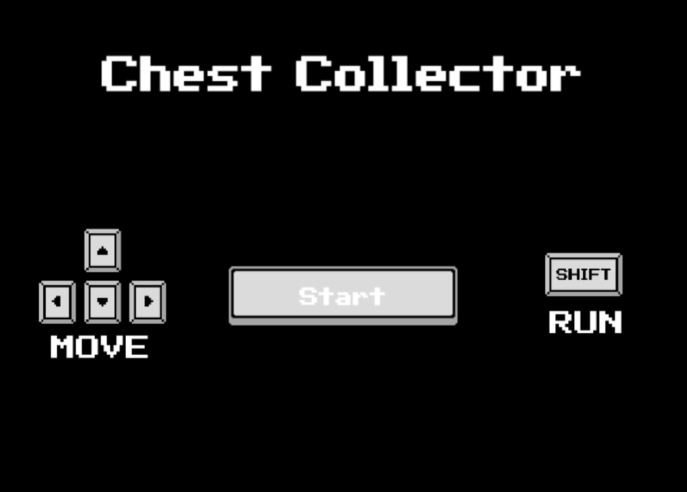
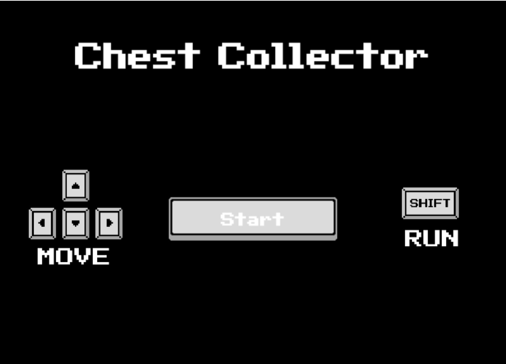
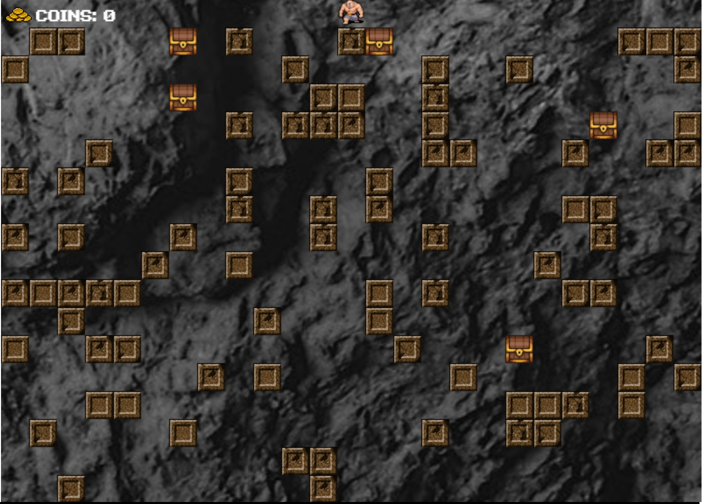

# **Chest Collector**

Just an introduction to the Game Framework "Phaser 3" 🕹️👾

## **Table of contents**

- [**Chest Collector**](#chest-collector)
  - [**Table of contents**](#table-of-contents)
  - [**General info**](#general-info)
  - [**Demo**](#demo)
  - [**Screenshots**](#screenshots)
  - [**Technologies**](#technologies)
  - [**Setup**](#setup)
  - [**Usage**](#usage)
  - [**Status**](#status)
  - [**Contact**](#contact)

## **General info**

**Date**: July, 2020  
**Duration**: 2 Days.

It is simply a first contact to know the basic parts of the framework "Phaser 3" 🕹️👾.

## **Demo**

You can try it using the [Demo](https://udsgit.github.io/chest-collector)

> <br> 
> <i>Demo</i>

## **Screenshots**

> 
> <br>
> <i>title screen and game screen</i>

## **Technologies**

- **JavaScript**&nbsp;&nbsp;
- [**Phaser 3**](https://phaser.io/)

## **Setup**

It has no installation, you just need to clone or download the repository.

```console
git clone https://github.com/udsgit/chest-collector.git
```

## **Usage**

1. Open the link from the [Demo](https://udsgit.github.io/chest-collector) or open the file **index.html** if you downloaded it.
2. Now you can interact with the "Game".
3. To move, you will use the arrows on the keyboard and you can take the chests that will appear. The game only consists of that, since it is a first contact.

## **Status**

Project is: **_Completed._**

Since it has served to know the first contact, but it will continue to be improved through new commits or new repositories making other games.

## **Contact**

Created by [@Emmanuel](https://www.linkedin.com/in/emagleza/), feel free to contact me!
